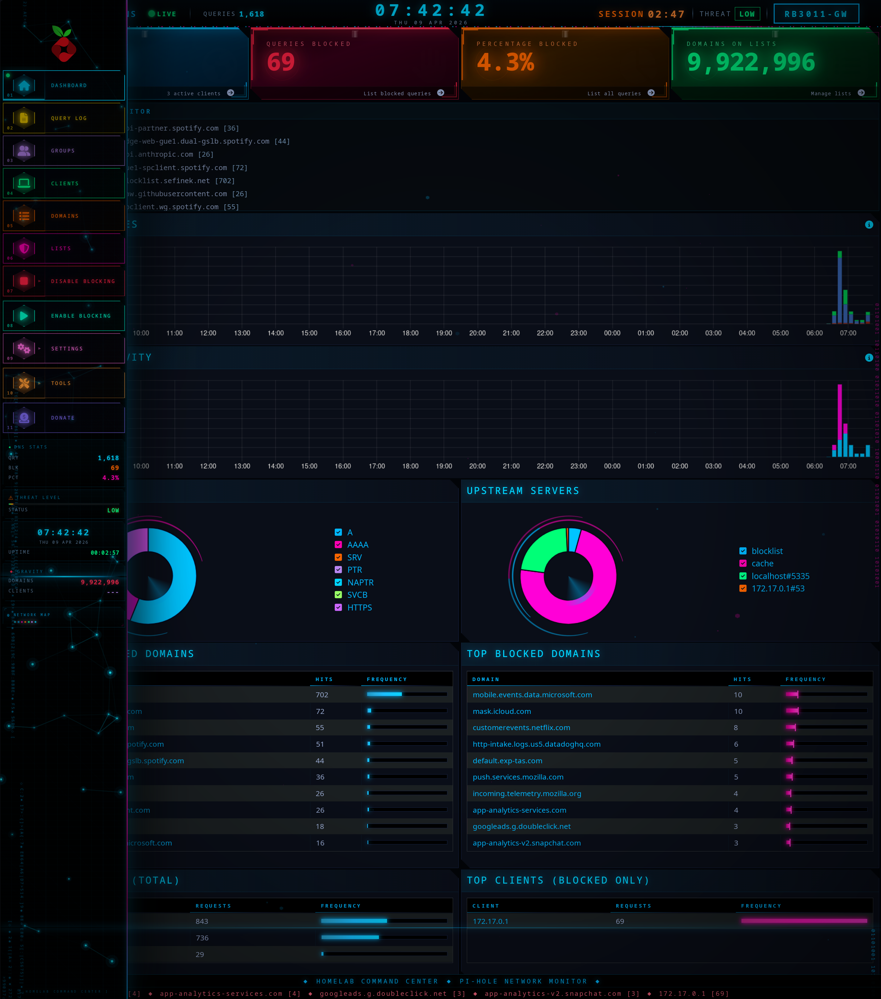

# HCC Observatory

**The visual showcase of the Home Control Center ecosystem.**

HCC (Home Control Center) is a multi-surface home platform by
[TechX Maestro](https://techxmaestro.com). This repo is a curated tour of
every visible surface of HCC — dashboards, native apps, custom UIs — with
every screenshot, every architecture diagram, and a deep-dive for each
piece.

---


---

## The HCC ecosystem at a glance

| Surface | Purpose | Docs |
|---------|---------|------|
| **Grafana Stack** | Metrics & log visualization — 7 dashboards (NAD receiver, Dell servers, MikroTik, RPi, Ollama/GPU, logs, Prometheus health) | [docs/grafana/](docs/grafana/) |
| **HCC Dashboard** | The web UI — Node.js/Express, installable PWA, 11 pages, drag-and-drop layouts, live polling | [docs/hcc-dashboard/](docs/hcc-dashboard/) |
| **HCC Android** | Native Kotlin/Compose phone + Wear OS app, biometric auth, Gotify push | [docs/hcc-android/](docs/hcc-android/) |
| **Pi-hole Theme** | Ground-up rebuild of the Pi-hole v6 admin UI in HCC's visual language | [docs/pihole-theme/](docs/pihole-theme/) |

---

## Shared visual language

Everything in HCC shares one design system — locked palette, same
typography, same motion vocabulary.

| Hex | Role | Share |
|-----|------|-------|
| `#00B7FF` / `#00d4ff` | Primary cyan | 70% |
| `#88C0D0` | Frost (secondary) | 15% |
| `#B986F2` | Violet (accent) | 8% |
| `#FF00B2` | Magenta (focal point) | 5% |
| `#BF616A` | Muted red (critical only) | <2% |

**Banned:** sage green, mustard yellow, standalone orange, Grafana's
`palette-classic`, AdminLTE's stock blue/red/yellow/green, any threshold
mode without explicit hex values from the locked palette.

**Typography:** JetBrains Mono across the board. Emoji as section markers
on Grafana — they scan faster than text at arm's length in a cyan-lit room.

**Motion vocabulary:** particles canvas, data rain (hex), scan line
sweep, HUD corner brackets, glitch headers, neon pulse on value change,
equalizer bars on panel headers, pulse rings on stat boxes, rotating
arcs on donut charts, ASCII boot sequence, click ripple.

Full design contract (Grafana-specific rules):
[docs/grafana/dashboard-contract.md](docs/grafana/dashboard-contract.md)

---

## Each surface, in one shot each

### Grafana — 7 brand-locked dashboards
File-provisioned. Prometheus + Loki backend on PER630. Full compose
stack in [compose/grafana.yml](compose/grafana.yml), all 7 dashboard
JSONs in [provisioning/dashboards/json/](provisioning/dashboards/json/).
Headless PNG rendering via a `grafana-image-renderer` sidecar.
→ [Full section](docs/grafana/)


### HCC Dashboard — web PWA
Node.js 20 + Express + vanilla HTML/CSS/JS + gridstack. 11 pages
(Home, Pi-hole, Servers, PER730, PER630, RPi, AI, Firewall, Network,
Router, Monitor, Control), drag-and-drop HOME layout saved to
localStorage, installable to desktop/phone home screen.
→ [Full section](docs/hcc-dashboard/)


### HCC Android — phone + watch
Kotlin + Jetpack Compose + Hilt. Phone app mirrors the dashboard's
core pages with a single shared `OverviewRepository` polling
`/api/overview`. Biometric auth on every cold launch. Wear OS
companion with glanceable NIGEL / FEED tiles and Gotify WebSocket
push notifications via a foreground service.
→ [Full section](docs/hcc-android/)


### Pi-hole Theme — custom command-center UI
~100 KB CSS + ~70 KB JS loaded into Pi-hole v6 via RouterOS-provisioned
fetch. Particles canvas, data rain, scan line, Chart.js recoloring,
boot sequence, floating network-topology popup. Survives container
restarts via a startup script.
→ [Full section](docs/pihole-theme/)



---

## Topology

```
       ┌───────────────────────────────────────────────────┐
       │                PHYSICAL HOMELAB                   │
       │   MikroTik RB3011  ·  PER630  ·  PER730XD         │
       │   Raspberry Pi 4B  ·  NAD T748v2  ·  Galaxy S24   │
       │   Galaxy Watch 7 Ultra                            │
       └────────────────────────┬──────────────────────────┘
                                │
      ┌─────────────────────────┼──────────────────────────┐
      │                         │                          │
      ▼                         ▼                          ▼
┌──────────┐           ┌──────────────┐          ┌──────────────┐
│ MiKROTIK │──config──▶│   PI-HOLE    │          │   GRAFANA    │
│  RB3011  │           │ (custom UI)  │◀──deploys│   STACK      │
└─────┬────┘           └──────┬───────┘          │  (PER630)    │
      │                       │                  └──────▲───────┘
      │ DHCP / DNS / firewall │ queries                 │
      │ via CAPsMAN for APs   │                         │ scrape +
      │                       │                         │ promtail
      ▼                       ▼                         │
┌───────────────────────────────────────┐               │
│   OVERVIEW POLL (every 10s)           │               │
│   /api/overview on HCC Dashboard      │               │
│   Aggregates: Pi-hole · Prometheus ·  │───────────────┘
│   RouterOS · Grafana · Ollama · iDRAC │
└────────────┬──────────────────────────┘
             │
   ┌─────────┴──────────┐
   ▼                    ▼
┌─────────┐      ┌──────────────┐
│ HCC WEB │      │ HCC ANDROID  │
│ PWA     │      │ (phone+wear) │
└─────────┘      └──────────────┘

+ GOTIFY push channel → Android foreground service → watch tile
```

Detailed Grafana stack architecture:
[docs/grafana/architecture.md](docs/grafana/architecture.md)

---

## Running the Grafana side of this repo

```sh
# 1. Set the renderer token (Grafana refuses to boot without it)
cp .env.example .env
printf 'GRAFANA_RENDERER_TOKEN=%s\n' "$(openssl rand -hex 32)" > .env
chmod 600 .env

# 2. Bring up the stack
docker compose -f compose/grafana.yml up -d

# 3. Verify
curl -sk https://grafana.home/api/health

# 4. Render all 7 dashboards to PNG
./scripts/render-all-dashboards.sh
```

The other surfaces (HCC Dashboard, Android, Pi-hole Theme) live in their
own private repos — this repo is the **showcase**, not the deployment
source for them.

---

## Repository layout

```
hcc-observatory/
├── README.md                           # this file — HCC ecosystem showcase
├── LICENSE                             # proprietary (TechX Maestro)
├── NOTICE.md                           # trademarks
├── .env.example
├── compose/
│   └── grafana.yml                     # grafana + image-renderer
├── provisioning/
│   ├── dashboards/
│   │   ├── homelab.yml                 # provider (rescan 30s)
│   │   └── json/                       # 7 dashboard JSONs
│   └── datasources/
│       └── prometheus.yml              # prom + loki datasources
├── alerts/
│   ├── alerts-homelab.yml              # Prometheus alert rules
│   └── alerts-pihole.yml
├── scripts/
│   ├── grafana-screenshot.sh           # single dashboard / panel PNG
│   └── render-all-dashboards.sh        # batch all 7
└── docs/
    ├── grafana/                        # metrics layer showcase
    │   ├── README.md
    │   ├── architecture.md
    │   ├── dashboard-contract.md
    │   ├── dashboards/                 # 7 per-dashboard deep dives
    │   └── screenshots/                # 7 dashboard PNGs
    ├── hcc-dashboard/                  # web UI showcase
    │   ├── README.md
    │   └── screenshots/                # 13 page PNGs
    ├── hcc-android/                    # mobile+wear showcase
    │   ├── README.md
    │   └── screenshots/                # 10 screen PNGs
    └── pihole-theme/                   # Pi-hole custom UI showcase
        ├── README.md
        └── screenshots/                # 3 PNGs
```

---

## Licensing

All source, configuration, documentation, and visual design in this
repository are the proprietary property of TechX Maestro. See
[LICENSE](LICENSE) and [NOTICE.md](NOTICE.md).

The trademarks **TechX Maestro**, **HCC**, **Home Control Center**,
**Serina**, **Nigel**, and **TechX OS** — along with all associated logos,
wordmarks, icons, Nigel sprites, color schemes, and UI visual design — are
trademarks of TechX Maestro.

Third-party components (Grafana, Prometheus, Loki, AdminLTE, gridstack.js,
Chart.js, etc.) retain their original licenses per LICENSE section 4.

## Credits

- **Grafana Labs** — Grafana + grafana-image-renderer
- **mrlhansen/idrac_exporter** · **akpw/mktxp** · **prometheus/snmp_exporter**
  · **ekofr/pihole-exporter** — the exporter inventory behind Grafana
- **AdminLTE** — Pi-hole v6 base framework
- **gridstack.js** — drag-and-drop engine powering HCC Dashboard
- **Chart.js** — all chart rendering in the Pi-hole theme
- **Jetpack Compose + Hilt** — HCC Android foundation
- **NAD Electronics** — for documenting the T748 RS-232 protocol

---

Part of the [TechX Maestro](https://techxmaestro.com) HCC product line.
