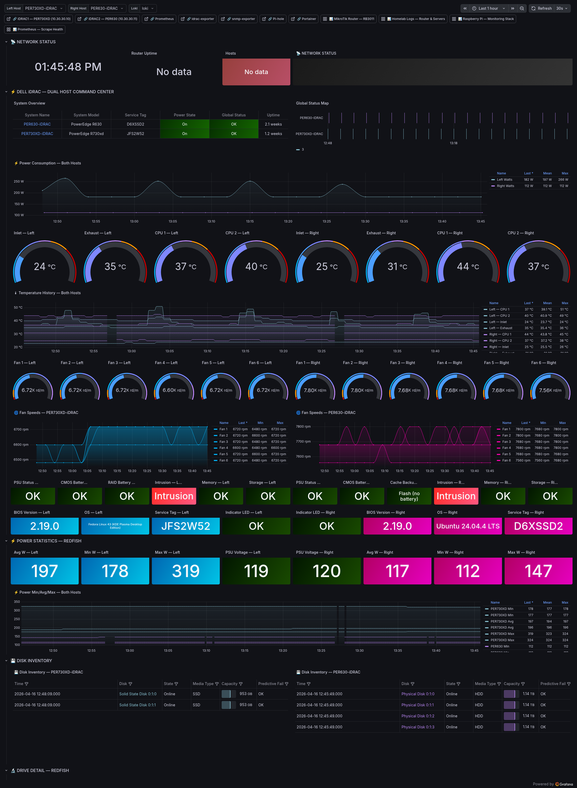

# Dell Servers — iDRAC Command Center

**UID:** `idrac-dual-command-center`
**Live URL:** https://grafana.home/d/idrac-dual-command-center
**Source JSON:** [`provisioning/dashboards/json/dell-servers.json`](../../provisioning/dashboards/json/dell-servers.json)
**Data sources:** Prometheus (snmp-exporter · dell_idrac module) + Prometheus (idrac_exporter via Redfish) + Loki (iDRAC syslog relay)

## What this is

Dual-host command center for two rack servers:

- **PER730XD** — Dell PowerEdge R730XD (2×Xeon E5-2680v4, 256GB DDR4,
  12×3.5" bays, PERC H730, dual PSU)
- **PER630** — Dell PowerEdge R630 (2×Xeon E5-2680v4, 128GB, 8×2.5" bays,
  PERC H730 mini, dual PSU)

Both have iDRAC8 Enterprise. The dashboard combines two scrape paths:

1. **SNMP** via `snmp-exporter` with the Dell iDRAC MIB module — sensors,
   temperatures, fans, PSUs, RAID controller health
2. **Redfish** via `idrac_exporter` (mrlhansen/idrac_exporter) — drive
   detail, link speeds, power min/avg/max, BIOS/firmware inventory, SEL

Together they give essentially every data point the BMC exposes.

## Dashboard sections

### ⚡ DELL iDRAC — DUAL HOST COMMAND CENTER
- **System Overview** table — service tag, model, BIOS, iDRAC firmware,
  boot time, power state. Left/right columns mirror the two hosts.
- **Global Status Map** — `status-history` showing health state over
  time. Color-mapped 0=OK (cyan), 1=Warn (violet), 2=Critical (muted red).
  See [feedback_redfish_health.md] — iDRAC severity is not intuitive;
  value mappings are explicit.
- **Power Consumption** — combined time series, both hosts on one axis so
  you can compare steady-state loads at a glance.
- **Temperature gauges** — inlet, exhaust, CPU1, CPU2 for each host.
  Thresholds: cyan <60°C, violet 60–75°C, muted red >75°C.
- **Temperature History** — combined time series with step traces.
- **Fan gauges** — 6 fans per host, 12 gauges total. RPM only.
- **Fan Speeds time series** — per host, stacked lines.
- **PSU / CMOS / RAID Battery / Intrusion / Memory / Storage** — stat
  panels, one per subsystem per host. Value-mapped strings so "OK" shows
  cyan, "Unknown" shows frost (not alarming), "Critical" shows muted red.

### ⚡ POWER STATISTICS — REDFISH
Min/Avg/Max wattage per host from Redfish `/redfish/v1/Chassis/*/Power`.
PSU input voltage per host. Combined power min/avg/max timeseries across
both hosts.

### 💾 DISK INVENTORY
Two tables, one per host. Bay, model, capacity, block size, serial,
SMART status. PER730XD's 12 bays include both spinning drives (RAID10
for VM storage) and flash (PERC-backed cache volume).

### 🔬 DRIVE DETAIL — REDFISH
Redfish exposes fields SNMP doesn't — media type, protocol (SATA/SAS/NVMe),
rotation speed, part numbers, link speed. Table is sorted by bay ID.

### 🖥️ CPU & MEMORY
- CPU model + core/thread count stat panels per host
- Memory module table — bank, size, speed, manufacturer, part number, rank
- Total RAM + socket count stat panels
- Two PER730XD has 16 DIMMs installed, PER630 has 8

### 💿 RAID ARRAY & STORAGE
- Controller health stat (PERC H730 on PER730XD, PERC H730 Mini on PER630)
- Array table — virtual disk ID, name, RAID level, size, state
- Volume health aggregate
- Storage controllers table — firmware version, cache size, battery state

Known limitation: **PERC H730 blocks SMART/wear-level telemetry on
RAID-attached SATA SSDs**. The OID returns 0. Panels map `0 → "N/A (not
reported by firmware)"` rather than showing a misleading zero.

### 🌐 NETWORK ADAPTERS
Redfish-sourced: NIC vendor, model, MAC, port count, firmware, link
state. PER730XD has 4×1GbE onboard + 2×10GbE mezz; PER630 has 4×1GbE.

### ⚡ LINK SPEEDS — REDFISH
Time series of negotiated link speed per NIC port. Catches flapping links
or drops to 100M/10M when a cable goes bad.

### 📋 SYSTEM EVENT LOG
The iDRAC SEL, rendered as a table. Severity color-mapped. Auto-refreshes
every 30s.

### 📋 iDRAC SYSLOG — LOKI
iDRACs relay syslog via RFC3164 to promtail on the RPi → Loki. Panels:
- **iDRAC Log Volume** — rate over time
- Two log-stream panels (one per host) with severity-colored lines

## Engineering notes

- **Two exporters, not one.** Redfish is slow and rate-limited; SNMP is
  faster but exposes less detail. Running both lets dashboards query
  whichever source is better for a given metric — power stats from
  Redfish, fan RPMs from SNMP.
- **Variable `host_left` / `host_right`.** The dashboard is hardcoded to
  exactly two hosts. When a third server joins the rack, this will need
  refactoring to multi-host via `host` variable repetition.
- **PER630 uses flash-backed cache, not a battery.** The "RAID Battery"
  stat panel is replaced on PER630 by "Cache Backup" with the value
  mapping `null → "N/A (Cap)"`.
