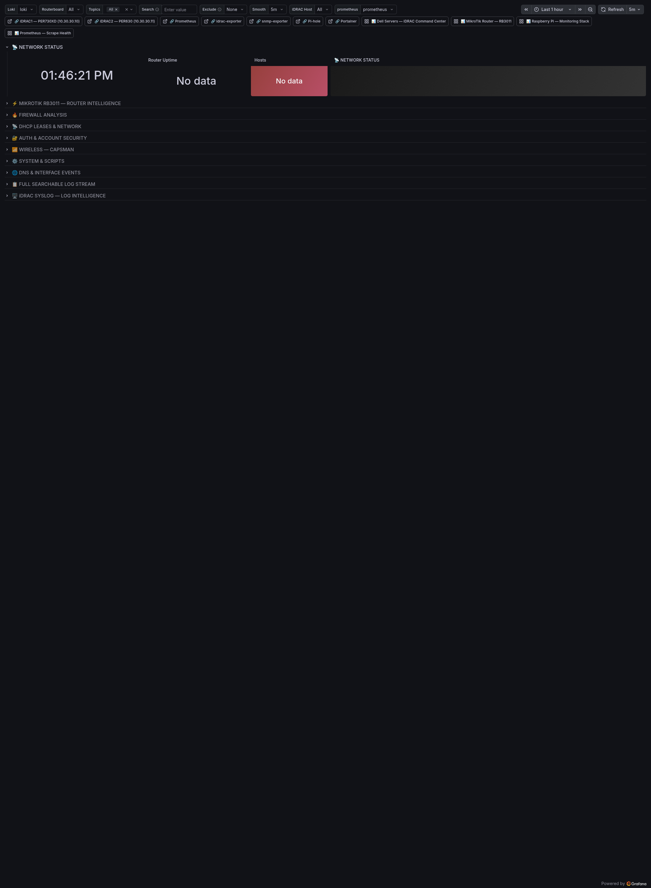

# Homelab Logs — Router & Servers

**UID:** `homelab-log-intelligence`
**Live URL:** https://grafana.home/d/homelab-log-intelligence
**Source JSON:** [`provisioning/dashboards/json/homelab-logs.json`](../../provisioning/dashboards/json/homelab-logs.json)
**Data sources:** Loki (primary) + Prometheus (for the upper stat strip)

## What this is

Unified log intelligence across the RouterOS box and the two Dell hosts.
Every log source ships syslog to promtail on the RPi, promtail pushes to
Loki, and this dashboard is the one place to answer any "what happened
at time X" question.

It is the most Loki-heavy dashboard in the observatory — almost every
panel is either a LogQL metric query (for the stat/timeseries panels)
or a raw log stream (for the `logs` panels at the bottom of each row).

## Dashboard sections

### ⚡ MIKROTIK RB3011 — ROUTER INTELLIGENCE
Topline counters for router log volume:
- **Total Logs** stat — count of events in range
- **Errors & Critical** stat
- **Warnings** stat
- **Firewall Hits** stat
- **DHCP Events** stat
- **Auth & Account Events** stat
- **Log Volume by Topic** time series — stacked area by RouterOS topic
  label (firewall, dhcp, wireless, system, etc.)

### 🔥 FIREWALL ANALYSIS
- **Firewall Hits (Range)** stat — total firewall-topic log lines.
- **AP/MAC Rejections** stat — wireless rejections, typically from an
  unknown MAC attempting to connect.
- **Firewall Matches** stat.
- **Firewall Activity Over Time** time series.
- **Firewall Event Stream** logs panel — searchable raw log list.

### 📡 DHCP LEASES & NETWORK
- **DHCP Assignments / Deassignments** stats.
- **DHCP Activity Over Time** — paired with the network topology, this
  is how you spot when a device reconnects / changes MAC / rejoins
  after a reboot.
- **DHCP Event Stream** logs.

### 🔐 AUTH & ACCOUNT SECURITY
- **Login Events** stat.
- **Auth Failures** stat — every `login failure` from the router.
- **Config Changes** stat — every `/system logging` event or
  `/system script run`.
- **Auth & Account Activity** time series.
- **Auth & Account Event Stream** logs panel.

### 📶 WIRELESS — CAPSMAN
- **AP Rejections** stat — unauthorized APs attempting to join.
- **Wireless Events** stat — overall CAPsMAN chatter.
- **CAPsMAN Non-Rejection Events** stat — auth successes, roaming,
  registration, deregistration.
- **Wireless Activity Over Time** time series.
- **CAPsMAN / Wireless Event Stream** logs panel.

### ⚙️ SYSTEM & SCRIPTS
- **System Events** logs panel — system-topic lines.
- **Script Events** logs panel — anything tagged `script`, which
  includes scheduled jobs and manual `/system script run` invocations.

### 🌐 DNS & INTERFACE EVENTS
- **DNS Events** logs panel — RouterOS DNS topic (separate from Pi-hole
  queries; this captures the router's own resolver decisions).
- **Interface & Link Events** logs panel — link up/down, duplex renegotiate.

### 📋 FULL SEARCHABLE LOG STREAM
- **All Router Logs — Filtered** — one massive logs panel with LogQL
  filters exposed via dashboard variables. Default filter is empty
  (all logs); users drop in a `|~ "auth"` or `|= "dhcp"` to narrow.

### 🖥️ iDRAC SYSLOG — LOG INTELLIGENCE
Parallel structure for the Dell iDRACs:
- **Total Events / Critical / Warning / Informational / Audit /
  Configuration** stat panels (six).
- **Log Volume by Host** — time series, split by PER730XD vs PER630.
- **Events by Severity** — time series, stacked by severity level.
- **Critical & Warning Alerts — Both Hosts** — logs panel, severity-
  filtered LogQL.
- **iDRAC Syslog — PER730XD (Server1)** logs panel.
- **iDRAC Syslog — PER630 (Server2)** logs panel.
- **Audit & Auth Events** logs panel.
- **Configuration & Storage Events** logs panel.
- **Full iDRAC Syslog Stream — All Hosts** logs panel — unfiltered merge.

## Engineering notes

- **LogQL metric queries for stats.** Every stat panel in this dashboard
  uses a `sum(count_over_time({...}[$__range]))` pattern against Loki.
  This is slower than a Prometheus range query — a full dashboard load
  with a 24h range can take 5–8 seconds. Acceptable for an audit tool.
- **Labels are the API.** Log lines are parsed by promtail with a
  structured pipeline: RouterOS topics become `topic=` labels, iDRAC
  severities become `severity=` labels. Adding a new label is a Loki
  index change and requires a careful plan — this is why the topic
  taxonomy hasn't changed since initial setup.
- **Promtail on the RPi is the bottleneck.** The Pi's SSD endurance is
  the ceiling for log retention. Current setting: 30 days retention,
  which yields a ~40 GB Loki chunk store. Plan is to move Loki off the
  Pi if retention ever needs to grow past 90 days.
- **Every log panel has "Live" disabled.** Live tail is cool but it's
  also a memory leak on large dashboards — users hit refresh instead.
