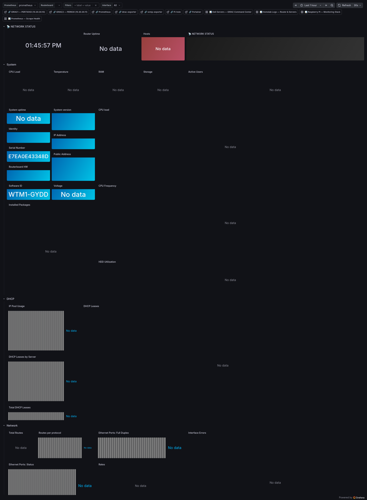

# MikroTik Router — RB3011

**UID:** `mikrotik-mktxp`
**Live URL:** https://grafana.home/d/mikrotik-mktxp
**Source JSON:** [`provisioning/dashboards/json/mikrotik-router.json`](../../provisioning/dashboards/json/mikrotik-router.json)
**Data sources:** Prometheus (mktxp + snmp-exporter RouterOS module)

## What this is

Everything the RB3011 exposes, on one pane. The RB3011 is the core router
for the entire homelab — 10 Gigabit ports, PoE, CAPsMAN wireless controller
for off-router APs. It serves VLAN 10/20/30/40/50/60 (management,
servers, IoT, workstation, AV, guest respectively) and runs firewall,
DHCP, NAT, netwatch, and mKTxp-exporter as packages.

## Dashboard sections

### System (row)
- **CPU Load / Temperature / RAM / Storage gauges** — the four-up live
  health strip. RB3011 idles at ~3% CPU, ~150MB RAM, ~40°C.
- **Active Users** table — who's logged in right now (admin API).
- **Uptime / Version / Identity / IP / Serial / Public Address /
  Hardware / Software ID / Voltage** — bulk stat panels covering
  everything that's nominally static but worth seeing.
- **CPU Load time series** — 1m/5m/15m load averages.
- **CPU Frequency time series** — the RB3011 scales between 600 and
  1400 MHz depending on load.
- **Installed Packages** table — firmware + extra packages (LTE,
  wireless, routing-bgp, etc.).
- **HDD Utilization** — flash writes over time.

### DHCP (row)
- **IP Pool Usage** bargauge — per-pool % used.
- **DHCP Leases** table — full lease list, active + expired.
- **DHCP Leases by Server** — one bar per DHCP server (vlan10_dhcp,
  vlan20_dhcp, etc).
- **Total DHCP Leases** — aggregate.

### Network (row)
- **Total Routes** gauge + **Routes per protocol** bargauge — static,
  connected, BGP, OSPF counts.
- **Ethernet Ports: Full Duplex / Status** — one bar per port showing
  link status (up/down) and duplex negotiation.
- **Interface Errors** time series — CRC/align/tx-err/rx-err per port.
- **Rates** table — current tx/rx bps per interface.
- **POE** table — PoE-out state per port, voltage, current, power.
- **Interfaces** table — full `/interface print` view.
- **Interface traffic** time series — combined view across all
  interfaces.
- **MTU** time series — MTU tracking per interface (catches PMTU drift).

### Firewall (row)
- **Address Lists** bargauges — bogons, spamhaus, blocklist counts.
- **Selected Address Lists** — the three or four most-used by byte.
- **Firewall Address Lists** table — all lists with entry counts.
- **Open Connections** table — current conntrack, sortable by
  src/dst/proto.
- **Open Connections Stats** bar chart — count by protocol.
- **Logged Firewall Rules Traffic** time series — only rules flagged
  `log=yes`.
- **Firewall Rules Traffic** time series — aggregate hits by chain.
- **Raw Firewall Rules Traffic** — raw table (pre-conntrack) stats.

### Netwatch (row)
- **Host Status History** — `state-timeline` per netwatch host. Cyan for
  up, magenta for down, matches the state-timeline convention used in
  the Logs dashboard. Replaced the previous `stat` panels in commit
  `b439605` after the stat variant couldn't show intermittent outages.

### Wireless / CAPsMAN (row)
- **Remote Caps** table — registered CAP devices (APs).
- **CAPsMAN Clients** table — every client and which AP they're
  connected to, signal strength, data rate.
- **CAPsMAN Registrations** bargauge — client count per AP.
- **Registered Client Signal Strength** bargauge — per-client RSSI.
- **CAPsMAN Clients Signal Strength** time series — per-client RSSI over
  time. Catches devices that roam poorly.
- **CAPsMAN Clients Traffic** time series — per-client throughput.

### MKTXP Metrics (row)
Internal health of the mktxp exporter itself:
- **MKTXP Collection Times** — per-module scrape duration
- **CAPsMAN client count**
- **Total SNMP time**
- **Neighbors** table — MNDP-discovered neighbors
- **PDUs returned**, **Time SNMP walk**

### Interfaces Traffic (row) — repeating
Per-interface repeating row; one time-series panel per selected interface
showing bps in/out.

### Multicast / Unicast / Errors (row) — repeating
Three time series panels per interface:
- Total in/out (mcast/ucast/bcast breakdown)
- Tx errors by type
- Rx errors by type

## Engineering notes

- **mktxp vs SNMP.** mktxp uses the RouterOS REST API and gets things
  SNMP doesn't expose (conntrack depth, firewall counters per rule,
  PoE state). SNMP fills in the few gaps mktxp misses. Both run;
  Prometheus joins on instance label.
- **Per-interface repetition.** `Interface` variable is multi-select.
  The Interfaces Traffic and Multicast/Unicast/Errors rows repeat per
  selected interface. Selecting all 10 ports yields a 30-panel view.
- **Palette-classic forbidden.** Commit `71770eb` fixed every panel
  that was using `palette-classic` (random colors) and forced
  explicit thresholds routed through the locked palette.
- **Netwatch is cyan/magenta, not green/red.** Per the contract,
  up=cyan, down=magenta. Commit `474e2d1`.
