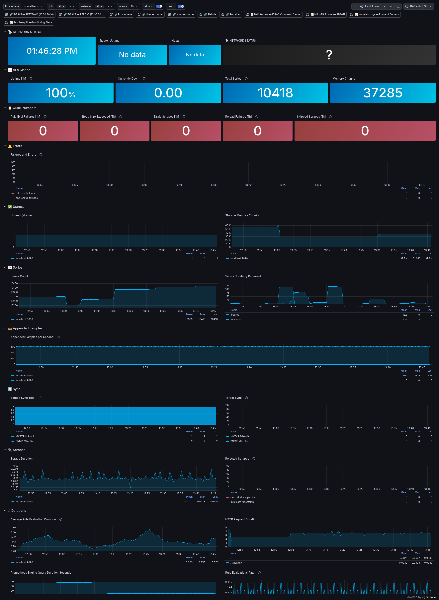

# Prometheus — Scrape Health

**UID:** `prometheus-health`
**Live URL:** https://grafana.home/d/prometheus-health
**Source JSON:** [`provisioning/dashboards/json/prometheus-health.json`](../../provisioning/dashboards/json/prometheus-health.json)
**Data source:** Prometheus (self-scrape)

## What this is

The meta-dashboard. Every other dashboard in the observatory trusts
Prometheus to deliver fresh, correct data. This dashboard verifies
that trust.

If this dashboard goes weird — rule evaluation failures climbing,
tardy scrapes multiplying, series count spiking — every other
dashboard is suspect until this one clears up.

## Dashboard sections

### 📊 At a Glance
- **Uptime [$interval]** stat — Prometheus process uptime over the
  range. Drops to 0 on restart; should be a flat line otherwise.
- **Currently Down** stat — count of targets with `up == 0` right now.
  Cyan=0, violet 1–2, muted red >2.
- **Total Series** stat — `prometheus_tsdb_head_series`. Growth rate
  of this number is cardinality pressure. Current baseline: ~18k
  series across all scrape jobs.
- **Memory Chunks** stat — in-memory chunk count from the head block.

### 📋 Quick Numbers
Five stats that should all be zero or near-zero:
- **Rule Eval Failures [$interval]** — alert rules failing to evaluate.
- **Body Size Exceeded [$interval]** — scrape response larger than the
  configured max body size (10 MB). If this is non-zero an exporter is
  misbehaving or the scrape interval is too long.
- **Tardy Scrapes [$interval]** — scrapes that took longer than their
  interval. Common culprits: iDRAC SNMP first-scrape after restart,
  Redfish on a busy host.
- **Reload Failures [$interval]** — config reload (SIGHUP) failures.
- **Skipped Scrapes [$interval]** — scrapes dropped because the previous
  one was still running.

### ⚠️ Errors
- **Failures and Errors** time series — combined rate of every
  `*_failures_total` and `*_errors_total` metric Prometheus emits.
  Stacked by error type.

### ✅ Upness
- **Upness (stacked)** time series — `sum by (job) (up)`, stacked area.
  Flat cyan bars = everything up. Step-down = something dropped.
- **Storage Memory Chunks** — `prometheus_tsdb_head_chunks` over time.

### 📈 Series
- **Series Count** — `prometheus_tsdb_head_series` over time. Watch for
  sudden increases (cardinality explosion from a misconfigured label).
- **Series Created / Removed** — rate of churn. High churn without
  growth means labels are rotating (e.g. container IDs leaking into
  labels).

### 📥 Appended Samples
- **Appended Samples per Second** — `rate(prometheus_tsdb_head_samples_appended_total[5m])`.
  Current baseline is ~1.5k samples/s.

### 🔄 Sync
- **Scrape Sync Total** time series — `prometheus_target_sync_length_seconds_count`.
- **Target Sync** — per-scrape-pool sync count.

### 🔍 Scrapes
- **Scrape Duration** — `prometheus_target_interval_length_seconds_sum / count`.
  Most jobs are <100ms; the iDRAC Redfish job averages 2–3s.
- **Rejected Scrapes** — scrapes rejected at the relabel stage.
  Should be zero.

### ⏱ Durations
- **Average Rule Evaluation Duration** — alert rule cost. Currently
  all rules evaluate in <5ms.
- **HTTP Request Duration** — Prometheus API latency.
- **Prometheus Engine Query Duration Seconds** — PromQL execution time.
- **Rule Evaluations Rate** — rate of rule evaluation.

### 🔔 Notifications
- **Notifications Sent** — rate of alerts fired to alertmanager.

### ⚙️ Config
- **Minutes Since Successful Config Reload** — how long since the last
  `SIGHUP` reload succeeded. Increases monotonically until a reload
  happens; is your "is the config you edited actually loaded" signal.
- **Successful Config Reload** — 1 if the current config parsed OK.

### 🗑 Garbage Collection
- **GC Rate / 2m** — Go GC events per 2m. High rate can indicate
  memory pressure.

## Engineering notes

- **This dashboard is rebuildable from scratch.** Every metric on it is
  a built-in `prometheus_*` metric — no custom exporters, no remote
  dependencies. You can copy this dashboard to any Prometheus deployment
  and it will work.
- **No alerts defined against this dashboard.** The prometheus-on-
  prometheus feedback loop is fragile — if Prometheus is sick, the
  alerts about Prometheus can't fire reliably. External checks
  (netwatch from the router, Gotify self-test) provide the actual
  "Prometheus is down" notification path.
- **Series growth is the thing to watch.** Single biggest cause of
  Prometheus pain in a homelab is accidental high-cardinality labels.
  If the Series Count panel ever jumps by a thousand on a deploy,
  revert and find the label.
