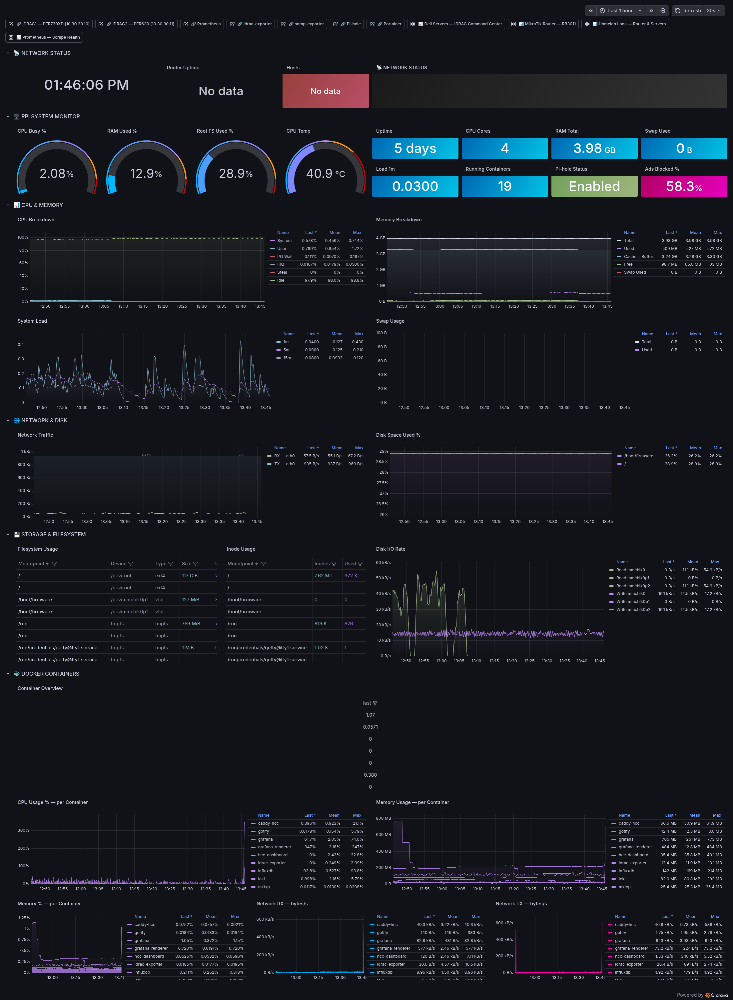

# Raspberry Pi — Monitoring Stack

**UID:** `rpi-unified`
**Live URL:** https://grafana.home/d/rpi-unified
**Source JSON:** [`provisioning/dashboards/json/rpi-monitor.json`](../../provisioning/dashboards/json/rpi-monitor.json)
**Data sources:** Prometheus (node_exporter · pihole-exporter · cadvisor)

## What this is

The Raspberry Pi in this homelab is a workhorse — Pi-hole, mktxp, promtail,
grafana-image-renderer scratch target, NAD RS-232 gateway, iDRAC syslog
relay, and a dozen smaller containers. This dashboard watches the Pi as
a machine, as a container host, and as a DNS resolver — three distinct
viewpoints on one pane.

## Dashboard sections

### 🖥️ RPi SYSTEM MONITOR
The four-up gauge strip: CPU Busy %, RAM Used %, Root FS Used %,
CPU Temp. Throttle threshold on the Pi 4B is 80°C — the temp gauge goes
muted-red at 75°C as early warning.

Then twelve stat panels:
- Uptime, CPU Cores, RAM Total, Swap Used
- Load 1m, Running Containers count
- Pi-hole Status, Ads Blocked %

### 📊 CPU & MEMORY
- **CPU Breakdown** time series — user/system/iowait/softirq/idle as
  stacked areas. Reveals whether load is actual work or iowait.
- **Memory Breakdown** — used/cached/free/buffers stacked.
- **System Load** — 1m/5m/15m load averages.
- **Swap Usage** — should be ≈ 0 on a Pi. If this ever grows, something
  is thrashing.

### 🌐 NETWORK & DISK
- **Network Traffic** — bytes/s per interface (eth0 + docker bridges).
- **Disk Space Used %** — stacked per filesystem over time.

### 💾 STORAGE & FILESYSTEM
- **Filesystem Usage** table — mountpoint, type, total, used, avail, %.
- **Inode Usage** table — inodes free + used. Catches "filesystem is
  full" cases where blocks are fine but inodes are exhausted.
- **Disk I/O Rate** — read/write bytes/s per device.

### 🐳 DOCKER CONTAINERS
cadvisor-backed section, one of the most detailed subsystem views in
the whole observatory:

- **Container Overview** table — name, image, state, uptime, CPU %,
  RAM used.
- **CPU Usage % — per Container** time series — stacked, palette-
  locked per container.
- **Memory Usage — per Container** — absolute bytes.
- **Memory % — per Container** — percentage of container limit, useful
  for tuning `mem_limit` values.
- **Network RX/TX — bytes/s per Container** — two panels.
- **Disk Read/Write — bytes/s per Container** — two panels.

### 🔒 PI-HOLE DNS
This is the dense one. Pi-hole is the default DNS resolver for every
VLAN, so its metrics are the cleanest view of "what's actually being
queried on the network." Panels:

- **Unique Clients / Unique Domains / Domains Blocked / Ads Blocked
  Today / DNS Queries Today / Queries Cached** — six stat panels.
- **DNS Query Types** pie chart — A, AAAA, PTR, HTTPS, SRV, etc.
- **Forward Destinations** pie chart — how many queries went to Cloudflare
  vs Quad9 vs the local conditional-forward upstream (RouterOS).
- **Replies by Type** pie chart — NODATA, NXDOMAIN, CACHE, FORWARD.
- **Top Queries** bargauge — most-queried domains over the range.
- **Top Blocked Domains** bargauge — most-blocked, ranked.
- **Top Query Sources** bargauge — per-client query counts. Only works
  because Pi-hole sees real client IPs (not the router gateway) — see
  [feedback_pihole_source_ip] for the action=redirect gotcha.
- **Ads Blocked Over Time** — absolute count time series.
- **Ads Blocked % Over Time** — percentage.
- **Queries — Cached vs Forwarded** — stacked area.
- **DNS Queries — All Types** — stacked by type.

## Engineering notes

- **pihole-exporter v1 API.** Uses Pi-hole's `/api.php` compat endpoint
  rather than the v6 native API, because the v6 API requires auth
  token rotation on every restart and the exporter doesn't yet handle
  that cleanly.
- **cadvisor on the Pi.** Runs as a container with `/sys`, `/var/run`,
  `/var/lib/docker`, and `/dev/disk` bind-mounts. CPU overhead is
  measurable (~2%) but the per-container visibility is worth it.
- **RAM RPi-sized panel sizing.** The Pi 4B has 8GB. Stat panels for
  memory hardcode 8 GiB as the "total" — if this ever migrates to a
  Pi 5 (16 GiB), the panel denominator needs updating.
- **Conditional forwarding.** Pi-hole is set up to forward queries for
  the local domain to RouterOS (10.10.10.1) so VLAN-specific DNS names
  resolve. If this breaks, the Forward Destinations panel will show
  a sudden shift to 100% external — useful as an early warning.
