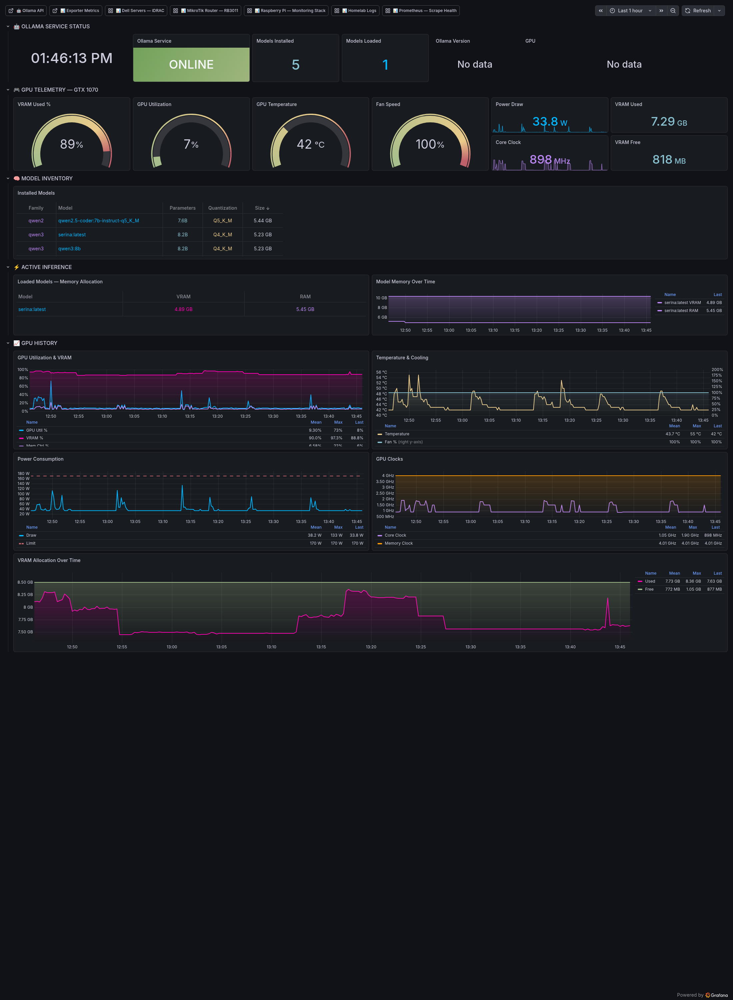

# AI Command Center — Ollama + GPU

**UID:** `hcc-ai-ollama`
**Live URL:** https://grafana.home/d/hcc-ai-ollama
**Source JSON:** [`provisioning/dashboards/json/ai-ollama.json`](../../../provisioning/dashboards/json/ai-ollama.json)
**Data source:** Prometheus (custom `ollama-exporter`)

## What this is

The AI tier of the homelab runs on PER730XD with a discrete GPU
(currently GTX 1070 — swap-in candidate for a bigger card is in the
roadmap). Ollama serves local inference for DeepSeek, Qwen, and the
Serina (HCC's AI assistant) personality stack.

The exporter is a custom Python service that wraps both `ollama list` /
`ollama ps` (via the HTTP API) and `nvidia-smi` queries into a single
Prometheus endpoint. Everything below is one scrape cycle away from
live.

## Dashboard sections

### 🤖 OLLAMA SERVICE STATUS
Six stat panels for service-level state:
- **Ollama Service** — Up/Down based on whether `/api/tags` returns 200.
- **Models Installed** — count from `ollama list`.
- **Models Loaded** — count from `ollama ps` (active in VRAM).
- **Ollama Version** — from `/api/version`.
- **GPU** — model string reported by nvidia-smi.

### 🎮 GPU TELEMETRY — GTX 1070
The heart of the dashboard. Four gauges side by side:
- **VRAM Used %** — 0–100% of 8 GiB. The GTX 1070's 8 GB is the binding
  constraint for most model swaps — 7B Q4 models fit, 13B don't.
- **GPU Utilization** — SM occupancy percent.
- **GPU Temperature** — °C. Thresholds: cyan <70°C, violet 70–83°C
  (thermal throttle), muted red >83°C.
- **Fan Speed** — %.

Then four stat panels: Power Draw (W), VRAM Used (MiB), Core Clock
(MHz), VRAM Free (MiB).

### 🧠 MODEL INVENTORY
**Installed Models** table. Columns: name, tag (Q4_K_M, Q5, etc.),
size on disk, family (llama, qwen, deepseek), parameter count, quantization
level, modified timestamp.

### ⚡ ACTIVE INFERENCE
**Loaded Models — Memory Allocation** table — the subset of installed
models currently resident in VRAM. Shows size-in-VRAM which is typically
~10% larger than size-on-disk due to KV cache allocation.

**Model Memory Over Time** — time series, stacked per model, showing
VRAM-resident memory. When a model gets unloaded (idle timeout) the
line drops to zero. When a request pulls a new model, the line spikes up.

### 📈 GPU HISTORY
Five time-series panels for deeper trend analysis:
- **GPU Utilization & VRAM** — two-axis, utilization left, VRAM right.
- **Temperature & Cooling** — temp + fan speed, two axes.
- **Power Consumption** — watts over time.
- **GPU Clocks** — core + memory clocks, reveals boost behavior.
- **VRAM Allocation Over Time** — same as the active-inference panel
  but with a longer default window.

## Engineering notes

- **Custom exporter, not the community one.** The ecosystem has a few
  "ollama exporters" but they all wrap either `/api/ps` or `nvidia-smi`,
  not both. This exporter unifies them so dashboard panels can join
  across model names and VRAM readings on the same timestamp.
- **nvidia-smi JSON mode.** The exporter uses
  `nvidia-smi --query-gpu=... --format=csv,nounits,noheader` to get a
  machine-readable snapshot every scrape. Single-GPU only; if a second
  card gets added, the exporter needs to emit per-GPU labels.
- **Ollama ps is expensive.** On a slow GPU it takes ~200ms per call;
  the exporter caches for 10s to avoid paying that cost on every scrape.
- **KV cache overhead.** The "size on disk" reported by Ollama doesn't
  include KV cache growth during inference. The dashboard's VRAM panels
  show the true resident footprint, which is what actually matters for
  OOM risk.
- **Roadmap.** GPU swap to a 16GB+ card (candidates in the roadmap memo)
  unblocks larger models + Mindcraft-style agents. This dashboard's
  panels are unit-aware and will scale without edits.
