# HCC Dashboard

The primary web surface of HCC. A single-page Node.js/Express app
deployed as a PWA, installable to phone/desktop home screens, serving
the full homelab command-center UI from a Raspberry Pi.

**Repo:** https://github.com/xbc4000/hcc-dashboard (private)
**Live URL:** https://hcc.home (Caddy → 10.20.20.3:3080 on PER630)
**Stack:** Node.js 20 + Express · vanilla HTML/CSS/JS · gridstack.js · Docker · host networking · bcrypt session auth · session-file-store · TLS-everywhere
**Deploy target:** PER630 (Dell PowerEdge R630, migrated from Raspberry Pi 4B 2026-04-15)

## What it does

Polls every subsystem in the homelab every 10 seconds (Pi-hole, Prometheus
iDRAC metrics, RouterOS API, Grafana health, Ollama + GPU, iDRAC/Portainer/
AMP liveness checks), fuses the results into a single `/api/overview`
response, and renders 15+ panels across multiple pages with drag-and-drop
layout customization on the HOME page.

Hardened 2026-04-11: TLS-everywhere, `session-file-store` for persistent
sessions across container restarts, fail-fast startup (refuses to boot if
any HMAC secret / TLS cert is missing instead of silently degrading).

## Screens

### HOME — drag-and-drop command deck
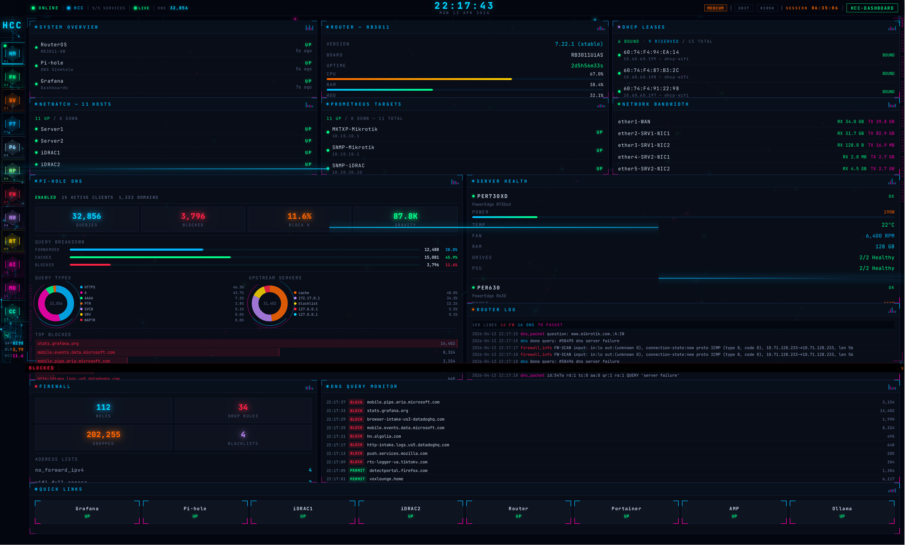

Hand-packed 12×20 gridstack layout, user-customizable in EDIT mode. Header
shows ONLINE/HCC indicators, services count, live DNS counter, centered
clock, threat badge, session timer.

### PI-HOLE — full DNS intelligence
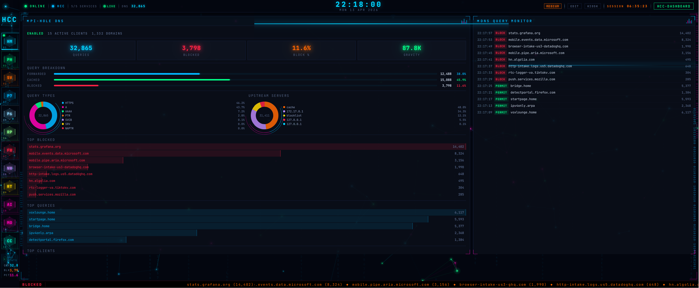

Live status, 4 stat boxes, breakdown bars, donut charts for query types
and upstreams, top blocked / top queries / top clients with proportional
bars, live query monitor feed.

### SERVERS — triple-host overview
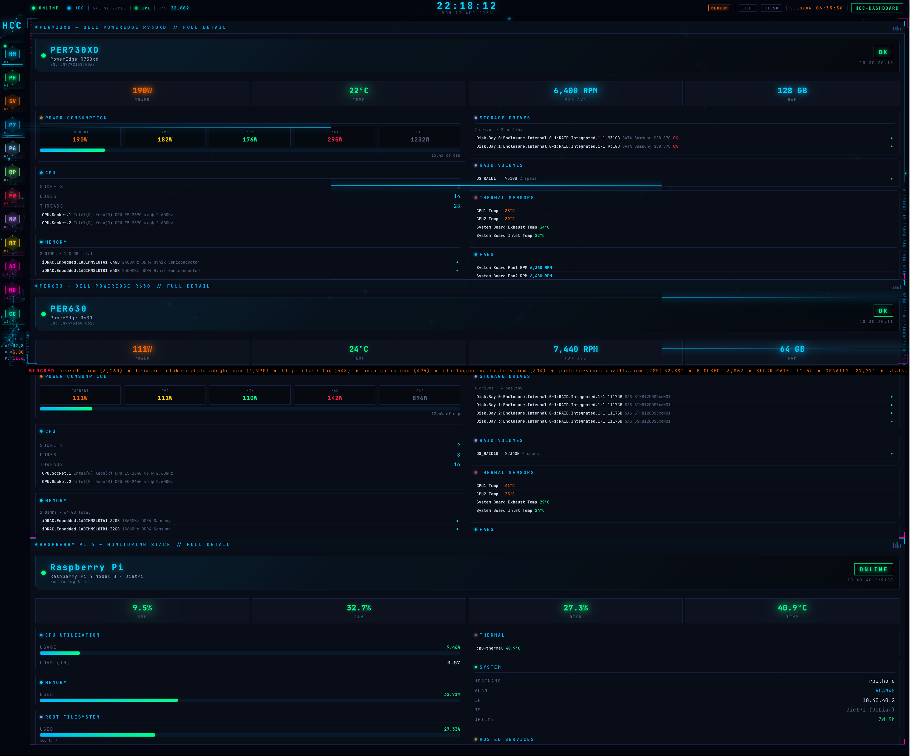

Stacked full-width detail panels for PER730XD, PER630, and the RPi.
Each panel's `data-pages` includes `servers` so they appear both here
and on their individual detail pages.

### PER730XD — full hardware breakdown
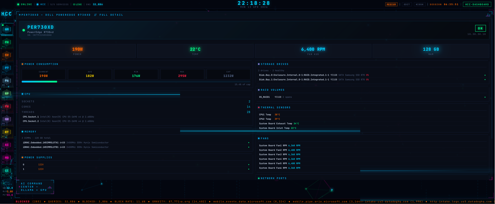

32 iDRAC metrics: power min/avg/max/cap, CPU sockets/cores/threads,
per-DIMM info, per-drive details, RAID volumes, all temperature sensors,
all fans, NIC ports. Single 12×12 panel.

### PER630 — dedicated detail
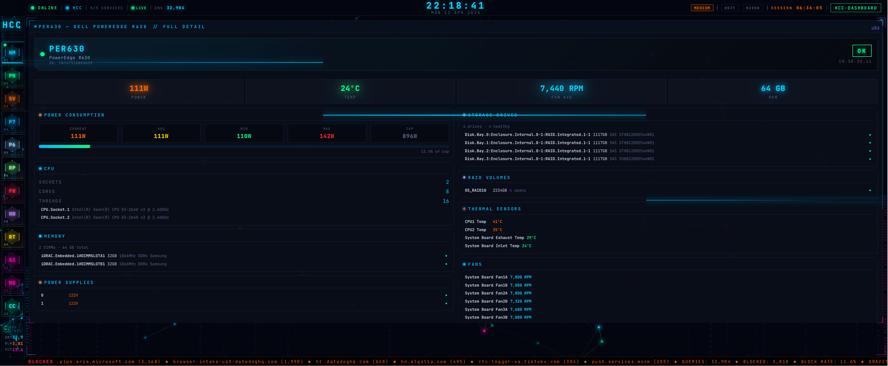

### RPi — Pi-hole host, Docker host, DNS server
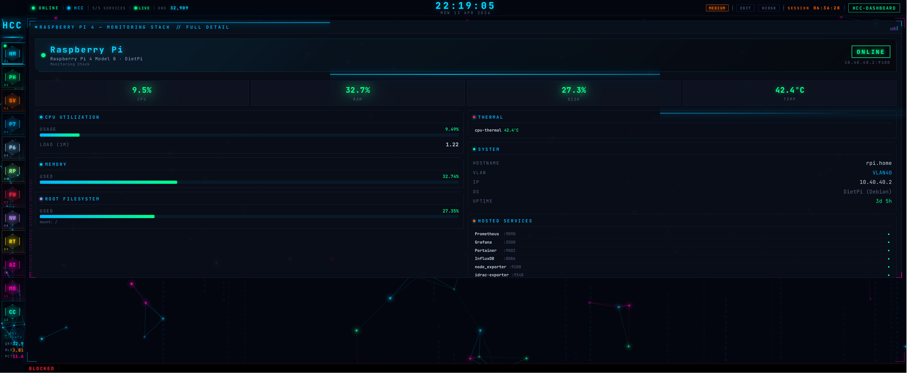

### FIREWALL
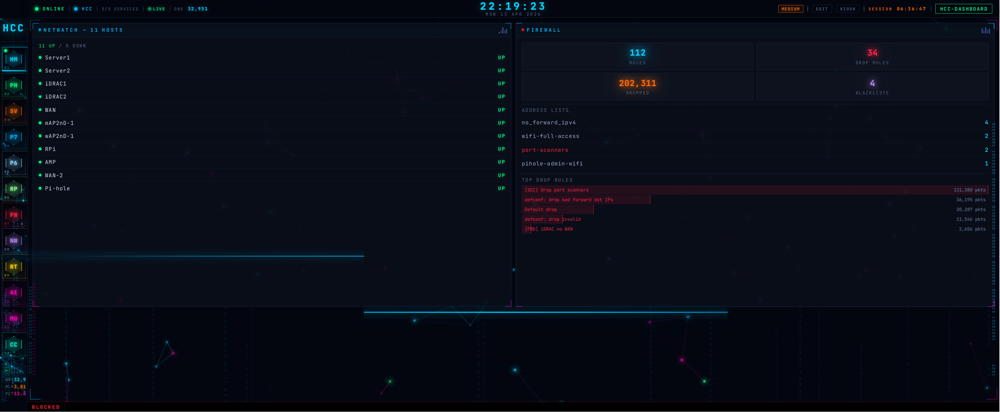

Rule counts, address lists, top drop rules with red filler bars.

### NETWORK DEVICES
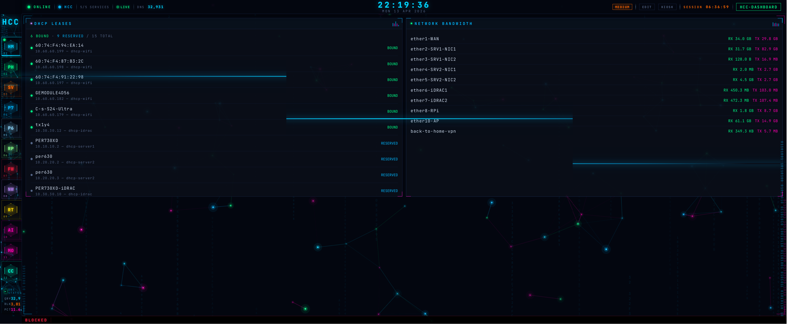

### ROUTER — MikroTik RB3011
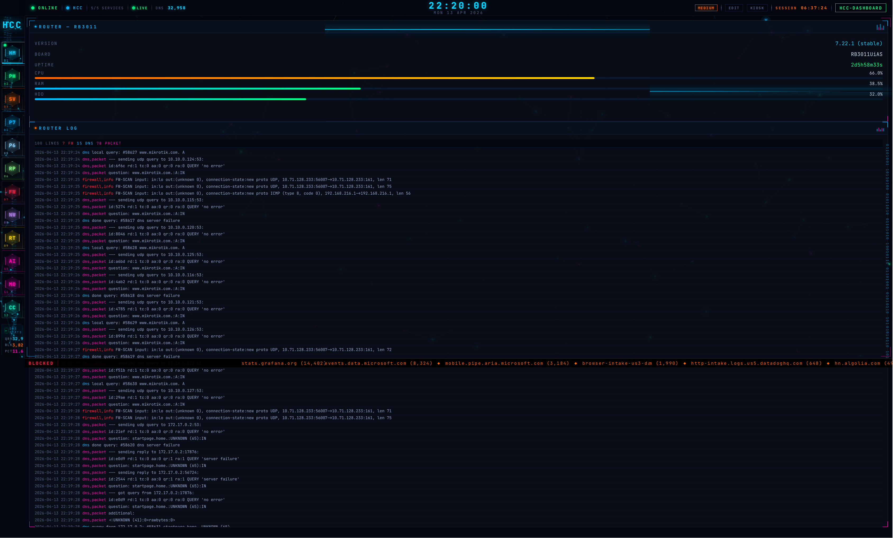

Router stats 12×4 on top + live 300-line RouterOS log tail 12×16 below.
Logs are color-coded by topic: errors/firewall red, warn orange,
dhcp/dns cyan, packet magenta. Sticky header shows per-topic counters.

### AI — Serina + Ollama
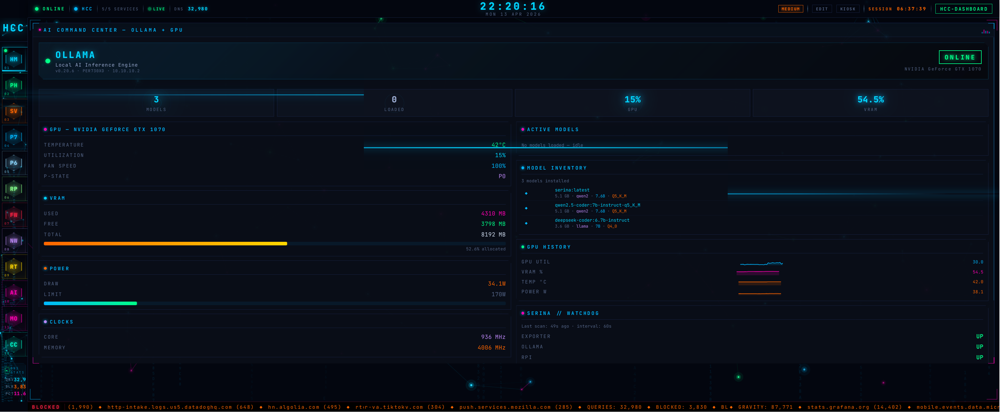

### MONITOR — aggregate health
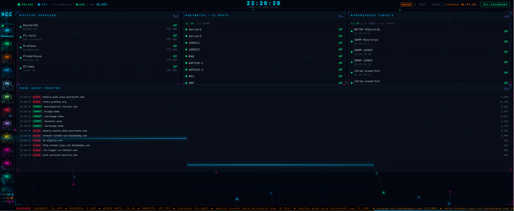

### CONTROL — integrations hub
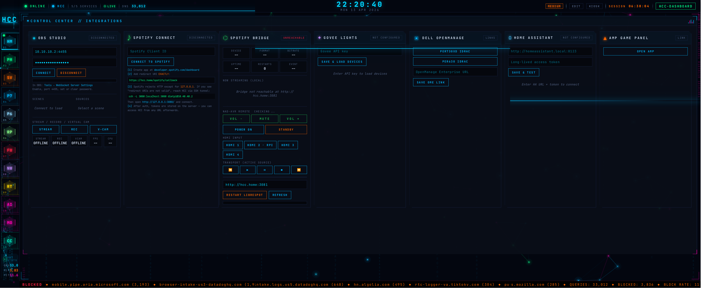

OBS Studio full WebSocket controller (PKCE auth), Spotify Connect web
player (server-side OAuth proxy), HCC Spotify Bridge status, Govee lights,
Dell OpenManage, Home Assistant, AMP Game Panel — all as cards on a
single page.

### NETWORK TOPOLOGY popout
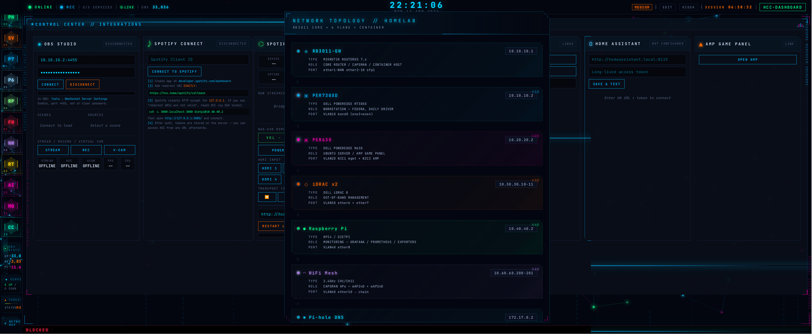

920px floating panel triggered from the sidebar. 7 device node cards
with full details, ASCII network diagram, 3 Jarvis analysis panels
(Threat / DataFlow / Infrastructure), session timer.

## Design system

- **Sidebar** — 78px collapsed / 260px on hover. HCC logo, 9 hex nav items
  with index numbers, scan-line sweep, accent-colored borders, DNS STATS
  widget, SERVICES widget, THREAT widget, NETWORK MAP trigger, particles
  canvas (35 nodes), 6-column data rain, scan line.
- **Effects** — 100-particle canvas (4-layer rendering), 40-column data
  rain, scan line, neon pulse on stat values, pulse rings on stat boxes,
  rotating arcs on donut charts, binary data streams on screen edges,
  viewport corner HUD, equalizer bars on panel headers, glitch flash on
  value change.
- **Audio** — chirp on queries, alert on blocks, alarm on service down.
- **Palette** — `#00d4ff` primary cyan · `#ff00b2` magenta · JetBrains
  Mono. Panel backgrounds at rgba 92% transparency.

## PWA

Installable as a home-screen app. `public/manifest.json`, `public/service-worker.js`
(cache-first shell + network-first for `/api/*` + network-only for `/auth/*`),
4 icon sizes. `SW_VERSION` in `service-worker.js` must be bumped on every
deploy or returning users see stale JS.

## Routing internals

Page-switch layouts use gridstack `makeWidget(el, opts)` with explicit
`gs-id` propagation (gridstack v10 silently strips gs-id when `node.id`
is falsy). HOME layout is hand-packed in `PAGE_LAYOUTS.home` — 12 cols ×
20 rows, 100% tiled, zero overlaps, zero gaps. Other pages have fixed
programmatic layouts. localStorage key `hcc-layouts-v4` — bump on any
layout-breaking panel change.

## Related

- [Pi-hole Theme](../pihole-theme/) — sibling project, same visual
  language; the sidebar particles + topology popup in HCC Dashboard were
  ported from the Pi-hole theme's JS.
- [HCC Android](../hcc-android/) — mobile client for the same backend API.
