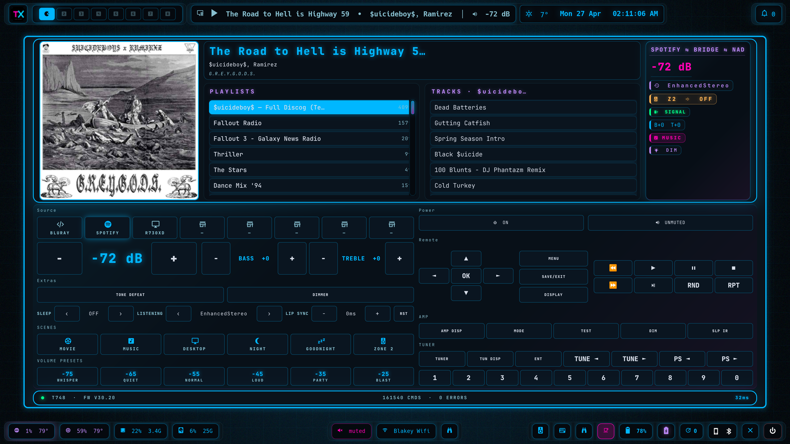
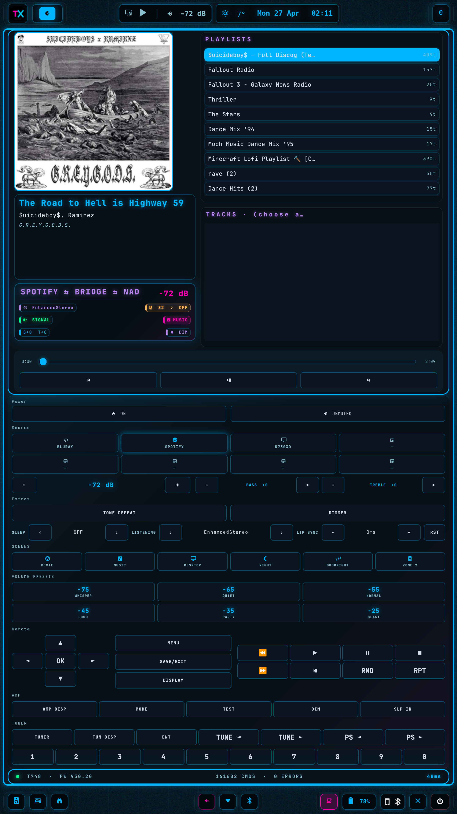

# HCC NAD

A native Rust + GTK4 fullscreen remote for the **NAD T748 AVR**, with a
built-in Spotify controller wired through the HCC Spotify Connect bridge.
Two layouts auto-swap based on screen orientation — wide landscape for
desk/dashboard hosts, narrow portrait for the rotated TX1Y4 ThinkPad
when it's mounted in tablet mode.

**Repo:** https://github.com/techx-maestro/hcc-nad (private)
**Stack:** Rust · gtk4-rs · gtk-layer-shell · tokio · reqwest
**Talks to:** `hcc-spotify-bridge` (RPi 10.40.40.2:3081), NAD T748 V2 over RS-232 via `hcc-nad-rs232` daemon
**Deploys to:** PER730XD (landscape, 1800×900) and TX1Y4 (portrait, 1080×1800 when rotated)

## What it does

Polls `/spotify/api/me/player` every 2s and `/status` from the NAD bridge
every 250ms. Renders a single fullscreen card with a live VFD-style header
(album art, song info, info pill with mode/signal/zone/scene/bass/treble
state), a Spotify scrubber + transport row, a playlist + tracks picker
with click-to-play, and a full NAD remote control grid below — sources,
volume, scenes, tone, mute, presets, listening modes, IR codes.

Both layouts are CSS-class-gated (`.nad-portrait`, `.nad-landscape`) and
adapt at runtime via a Hyprland transform watcher — rotate the TX and the
window flips orientation in place without restart.

## Screens

### Landscape — desk/dashboard layout

`[ ALBUM ART | PLAYLISTS | TRACKS | SPOTIFY/BRIDGE/NAD chip column ]`
top row with the song title, NAD info pill, and a six-row chip grid
(SPOTIFY · vol, mode · zone, signal · scene, tone · dim, sleep · tone,
mute) on the right. Bottom half is the full NAD remote — power, source
tiles, surround modes, tone deltas, scenes, IR codes, presets — wrapped
in one cyan outline (`overflow: hidden` + 16px border-radius) so the
inner widget backgrounds stay contained.

### Portrait — TX1Y4 rotated layout

When the TX1Y4 rotates into tablet mode (transform=1), the layout
switches: art_box drops to 370×370 and the picker stacks vertically
(playlists on top, tracks below) beside the art column. The info pill
re-anchors to the bottom of the art_col so its top edge aligns exactly
with the seek bar — locked via a horizontal SizeGroup binding art_box,
sp_meta, and the info pill all to the same width, plus a vertical
SizeGroup binding the picker height to the art_col height. Layout swap
is triggered by `techx-rotate.service` polling `hyprctl monitors -j`.

## Layout DNA

- **One outer cyan outline.** Single `.nad-window-frame` Box with
  `overflow: Hidden` clips every inner widget background to the
  rounded 16px corner — no nested squares inside the rounded outer
  ring.
- **Album art is a fixed-size square.** Pre-scaled at fetch time
  (`gdk_pixbuf::Pixbuf::scale_simple` to 360 landscape / 370 portrait)
  so `gtk::Picture`'s intrinsic-from-paintable can't propagate the
  CDN's 640px+ thumbnail size up through the layout.
- **Picker rows ellipsize.** Both playlist names and track names cap
  at `max_width_chars=30` with `EllipsizeMode::End`; the tracks header
  caps at 28 chars. `propagate_natural_width=false` on each
  `ScrolledWindow` so a long song name can't push the picker column
  past the window's 1800px request.
- **Click-to-play.** Each track ListBoxRow stamps its Spotify URI into
  `widget_name`; the parent ListBox's `row-activated` handler reads it
  back and `PUT`s `/spotify/api/me/player/play` with `{uris: [...]}`
  so playback locks to the exact track regardless of the current play
  context.

## Failure modes

- **Bridge offline:** all NAD chips render `—`, Spotify chip drops to
  `OFFLINE`, click-to-play silently no-ops (logged to stderr).
- **Spotify token stale:** `/spotify/api/me/player` returns 401, panel
  shows last-known state. Re-OAuth at `https://hcc.home/spotify/auth`.
- **AVR off:** `/status` returns 502 from the bridge after RS-232
  timeout; volume readout pegs to its last value, source chip greys.

## Visual surface

Same palette and typography as the rest of HCC — JetBrains Mono, cyan
`#00B7FF` outlines, pink `#FF00B2` and violet `#B986F2` accents, no
gradients on chips, glow via `text-shadow` not `box-shadow`. Aligned
with the [HCC dashboard contract](../../docs/hcc-dashboard/) and the
[Grafana NAD dashboard](../../docs/grafana/) so flipping between
surfaces feels like one product.
