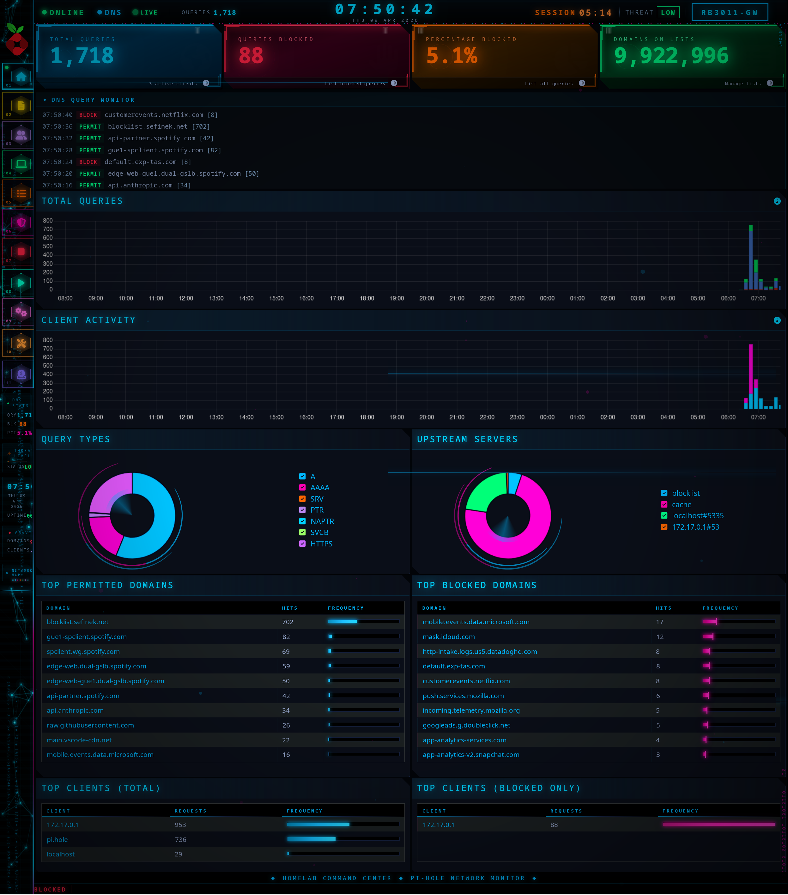
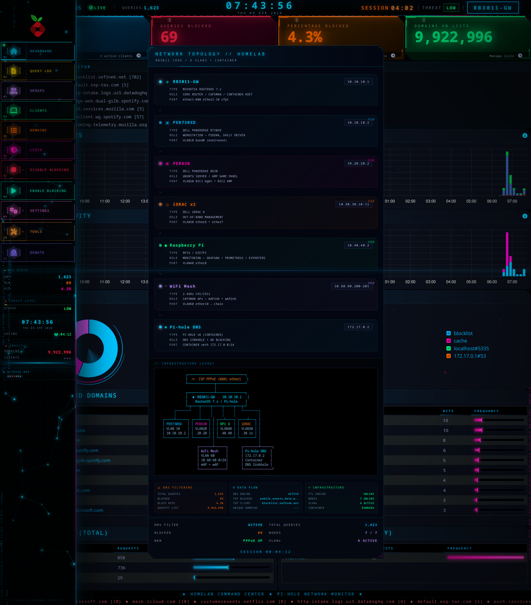

# Pi-hole Custom Theme

A ground-up rebuild of the Pi-hole v6 admin UI into a Jarvis/cyberpunk
homelab command center. Ships as two injected files (CSS + JS) loaded
automatically on container start via a RouterOS provisioning script.

**Source:** [`homelab-network/config/pihole-theme.{css,js}`](https://github.com/techx-maestro/homelab-network/tree/main/config)
**Deploy target:** Pi-hole v6 container on the Raspberry Pi
**Approximate size:** ~100 KB CSS + ~70 KB JS
**Loader:** RouterOS fetches from this repo's GitHub raw URL at commit-hash
pinning, pushes into `/etc/pihole/` and `/var/www/html/admin/style/` via
`/container/shell`, re-injects on container repull / restart.

## Why rebuild Pi-hole's UI

AdminLTE's default look is fine for an admin panel but doesn't match the
rest of the HCC aesthetic. Since every VLAN in the homelab resolves DNS
through Pi-hole, the admin UI is visited constantly — it needed to feel
like a part of the HCC command center, not a bolted-on subsystem.

## Dashboard


Main Pi-hole dashboard with the full custom treatment — scanline texture,
particle field canvas, data rain (hex characters), scan line sweep,
Chart.js recoloring, themed stat boxes, neon pulse on counter changes.

Header bar has been rebuilt: ONLINE indicator, live DNS counter, threat
badge, centered time display. Stat boxes (`.small-box.bg-*` in AdminLTE)
override the default blue/red/yellow/green to the locked HCC palette.

## Sidebar


Circuit-board treeview with HUD corner brackets, glitch-animated section
headers, magenta hover accents, click ripple effects. The NETWORK MAP
trigger at the bottom opens the floating topology popup.

## Network Topology


920px centered floating panel triggered from the sidebar. 7 device-node
cards (router, servers, Pi, endpoints) with full details, ASCII network
diagram, three Jarvis analysis panels (Threat / DataFlow / Infrastructure),
system status grid, session timer. Opaque `#030610` background so it
reads on any page without color bleed.

## Chart.js recoloring

Pi-hole uses Chart.js internally. Theming it is a minefield because
Chart.js v3 uses Proxy-wrapped option objects — touching `chart.options`
inside a hook causes infinite recursion.

Safe technique used here:
- **Never** call `Chart.register()` or mutate `Chart.defaults.plugins.*`
- **Never** read or write `chart.options` inside any Chart.js lifecycle hook
- Use a `setInterval` poller **outside** the Chart.js lifecycle
- Mutate `chart.data.datasets[N].<prop>` directly (backgroundColor,
  borderColor, etc.)
- Call `chart.update('none')` to skip animations
- Y-axis max: safe to set `chart.scales.y.max = value` then
  `chart.update('none')`
- Pi-hole's own `THEME_COLORS` mechanism handles the doughnut palette

## DNS Query Monitor

7-line live feed on the dashboard showing real-time PERMIT / BLOCK
events. Scrapes the DOM tables on the dashboard page; on sub-pages
falls back to the `#all-queries` table or the Pi-hole v5/v6 API.

## Boot sequence

Main page only. On page load: scanline grid + vignette overlay,
thick glowing scan line descent, HUD corner brackets, 8px-thick
progress bar, 36px percentage counter, SYSTEM INITIALIZATION label,
terminal text, glowing ASCII HOMELAB art, COMMAND CENTER banner,
cyan flash on completion (8000ms total).

## Deployment

```
1. git commit + push to homelab-network
2. RouterOS fetches from raw.githubusercontent.com with the commit hash
   pinned (raw.githubusercontent.com caches aggressively — must use
   commit-hash URLs to bypass CDN)
3. /container/shell 0 → cp to /var/www/html/admin/style/
4. Ctrl+Shift+R in browser — AdminLTE caches hard
```

Two critical paths:
- `/etc/pihole/` — persistent data mount (survives reboots but not repulls)
- `/var/www/html/admin/style/` — where Pi-hole **actually loads from**
  (resets on both reboot and repull)

The `pihole-theme-startup.sh` script re-copies from `/etc/pihole/` to
`/var/www/html/admin/style/` on every container start, so the theme
survives restarts automatically.

## Known quirks

- **CSP.** Pi-hole blocks external images (`img-src 'self'`), so all
  graphics are ASCII art or inline SVG. No external image loads.
- **CSS `:has()`** works in some selectors but is unreliable in Pi-hole's
  Lua-template context. Critical sizing always has a JS fallback.
- **RouterOS terminal chokes on multi-line paste**, so the `/tool/fetch`
  commands in the deploy script must be single lines.
- **AdminLTE uses `.box` components** (not `.card`) for collapsible
  panels — themeing `.card` selectors has no effect in some views.

## Related

- [HCC Dashboard](../hcc-dashboard/) — the HCC Dashboard's sidebar
  particles, topology popup, and boot-sequence elements are direct
  ports of the code in this theme.
